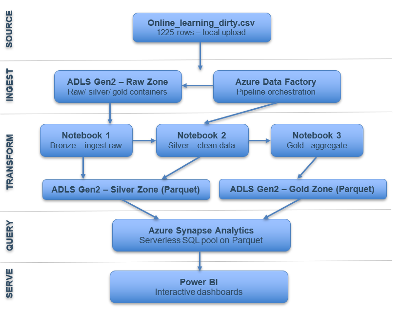

# 🎓 Online Learning Analytics — Azure Cloud Data Pipeline

> **End-to-end Medallion Architecture pipeline on Microsoft Azure** — transforming raw, inconsistent survey data into actionable business insights through automated ETL, cloud-native storage, and interactive Power BI dashboards.

> 📚 **Academic Context:** Submitted for the **Data Engineering & Analysis** subject — 6th Semester, B.Tech Information Technology


---

## 📊 Project Highlights

| Metric | Value |
|--------|-------|
| 📁 Raw Records Processed | 1,225+ |
| 🧹 Data Quality Issues Fixed | 7 error types |
| 📈 Data Quality Gain | ~95% |
| 🗄️ Storage Format | Parquet (partitioned) |
| ☁️ Cloud Platform | Microsoft Azure |
| 🎓 Subject | Data Engineering & Analysis (Sem 6) |

---

## 🧠 Problem Statement

Organizations generating data from online learning platforms often face **raw data that is incomplete, inconsistent, and unstructured**. Traditional processing methods lack the scalability and automation needed to clean and manage such data efficiently.

**Critical gaps this pipeline addresses:**
- No unified platform for end-to-end data lifecycle management
- Limited automation in data cleaning and preprocessing
- Difficulty scaling analytics workflows with growing data volume
- Lack of separation between raw, clean, and aggregated data layers

---

## 🏗️ Pipeline Architecture — Medallion Pattern



The pipeline follows the **Medallion Architecture** — an industry-standard pattern that organizes data into three progressive quality layers, each building on the previous one.

### 🥉 Raw Zone
Original dirty CSV stored **as-is** in ADLS Gen2. Unmodified audit baseline ingested via ADF copy activity.

### 🥈 Silver Zone
Cleaned, deduplicated **Parquet** files partitioned by `education_level`. All 7 data quality issues resolved via PySpark.

### 🥇 Gold Zone
Aggregated business metrics partitioned by dimension (`device`, `country`, `education`, `satisfaction`). Directly consumed by Power BI.

---

## 🛠️ Tech Stack

| Service | Role |
|---------|------|
| **Azure Data Lake Storage Gen2** | Hierarchical cloud storage — raw/silver/gold containers |
| **Azure Data Factory** | Pipeline orchestration & sequential notebook triggering |
| **Azure Databricks + Apache Spark** | Distributed PySpark ETL — cleaning, deduplication, feature engineering |
| **Azure Synapse Analytics** | Serverless SQL querying via `OPENROWSET` on Parquet |
| **Microsoft Power BI** | Interactive dashboards & KPI visualization |

---

## 🧹 Data Quality Issues Resolved

| Issue Type | Scale | Fix Applied |
|------------|-------|-------------|
| Missing Values | ~219 nulls | Median imputation; `'Unknown'` for categorical |
| Duplicate Rows | 17 rows | `dropDuplicates()` — one canonical record per user |
| Inconsistent Labels | ~290 rows | PySpark `when()` standardisation to canonical forms |
| Outliers | ~27 rows | Domain-bound filters (age 10–100, hours 0–168, quiz 0–100) |
| Whitespace / Format | ~40 rows | `F.trim()` + `F.lower()` across all string columns |
| Wrong Data Types | All cols | Explicit casting to `IntegerType` / `DoubleType` |
| Label Case Mixing | ~50 rows | Lowercase comparison before matching (MALE/Male/male) |

---

## 📐 Feature Engineering

Three new columns created in the Silver layer:

- `engagement_score` — composite metric derived from login frequency and hours spent weekly
- `satisfaction_group` — Low / Medium / High bucketing of the satisfaction rating (1–5 scale)
- `completed_binary` — standardised boolean from inconsistent completion flags (TRUE/FALSE/Yes/No)

---

## 📊 Power BI Dashboards & Key Insights

### Dashboard 1 — Executive Performance Dashboard

High-level KPIs and learner performance trends across the cleaned dataset.

**📌 Key Insights:**

- 🌍 **Australia and the UK lead in course completion rates** (~52–50%), while India and Canada trail slightly (~43%), suggesting regional differences in learner engagement or course accessibility.
- 🎓 **Master's degree students show the highest average quiz scores**, followed closely by PhD and Bachelor students — indicating that higher academic background correlates with better quiz performance.
- 📱 **Device usage is evenly distributed** at exactly 33.33% each across Desktop, Mobile, and Tablet — meaning the platform is accessed uniformly across all device types, making responsive design equally critical for all three.
- ⏱️ **The 10–15 hrs/week study band peaks in quiz scores (~70)** while the 15+ hrs band has the highest completion rate — suggesting moderate study time optimises performance, while longer hours reflect more committed (completion-focused) learners.
- 📉 **Completion rates are remarkably consistent across education levels** (all hovering near 46–49%), implying that education background alone does not determine whether a student finishes a course.

---

### Dashboard 2 — Behavioural & Advanced Analytics Dashboard

Deeper engagement patterns, demographic analysis, and satisfaction-behaviour relationships.

**📌 Key Insights:**

- 📈 **Login frequency shows a non-linear relationship with quiz scores** — users logging in 15–20 times score significantly higher (130–140 range in sum), but very low-frequency users (1–5 logins) cluster around mediocre scores, confirming that **consistent engagement is a stronger predictor of performance than total study hours alone**.
- 😐 **Counterintuitively, "Low" satisfaction students have the highest completion rate (47.9%)**, followed by Medium (46.8%) and High (45.6%) — suggesting that students who complete courses aren't necessarily the most satisfied, possibly due to external obligation rather than intrinsic motivation.
- 👥 **Gender distribution is nearly equal** across Female, Male, and Other categories (~33% each), validating the dataset's demographic balance and making gender-based comparisons statistically fair.
- 🌐 **Canada has the lowest average satisfaction (2.76)** while USA (3.11) and UK (3.1) score highest — pointing to potential regional differences in platform experience, course content relevance, or instructor quality.
- 📱 **The 26–35 age band on Mobile devices has the highest satisfaction (3.24)**, while the 36–45 group on Desktop scores lowest (2.71) — suggesting younger, mobile-first users have a better platform experience, which has implications for UI/UX prioritisation.
- 🔢 **Total satisfaction scores are consistent across genders** (Female ≈ Male ≈ Other at ~33% each within-gender), meaning satisfaction is not significantly gender-dependent in this dataset.

---

## 📁 Repository Structure

```
online-learning-azure-pipeline/
│
├── assets/
│   └── architecture.png             # Pipeline architecture diagram
│
├── notebooks/
│   ├── 01_bronze_ingest.ipynb       # Schema standardisation, CSV → Parquet
│   ├── 02_silver_clean.ipynb        # All 7 cleaning operations + feature engineering
│   └── 03_gold_aggregate.ipynb      # Business-level aggregations by dimension
│
├── data/
│   ├── raw/
│   │   └── online_learning_dirty.csv
│   ├── silver/
│   │   └── online_learning_user_behavior.csv
│   └── gold/
│       ├── by_country.csv
│       ├── by_device.csv
│       ├── by_education.csv
│       ├── by_satisfaction.csv
│       ├── by_study_band.csv
│       ├── age_device_heatmap.csv
│       ├── gender_completion.csv
│       ├── login_vs_score.csv
│       └── silver_overview.csv
│
├── powerbi/
│   └── OnlineLearningAnalytics.pbix
│
├── report/
│   └── ProjectFile.pdf
│
└── README.md
```

---

## 🚀 How to Run

### Prerequisites
- Azure subscription (free tier or student credits work)
- Azure Databricks workspace
- Azure Data Lake Storage Gen2 account
- Azure Synapse Analytics workspace
- Power BI Desktop

### Steps

1. **Upload raw data** to ADLS Gen2 `raw/` container
2. **Import notebooks** into Azure Databricks
3. **Configure ADF pipeline** to trigger notebooks sequentially:
   `01_bronze_ingest` → `02_silver_clean` → `03_gold_aggregate`
4. **Run Synapse SQL queries** against the Gold Parquet files
5. **Open Power BI Desktop** and connect to Synapse query outputs
6. **Refresh dashboards** to explore insights

---

## 🔭 Future Roadmap

| Phase | Enhancement | Azure Tool |
|-------|-------------|------------|
| Short-term | Real-Time Streaming | Azure Event Hub + Stream Analytics |
| Short-term | Automated Orchestration | ADF Triggers (scheduled / event-driven) |
| Mid-term | ML Completion Prediction | Azure Machine Learning (AutoML) |
| Mid-term | Predictive Dashboards | Power BI + Azure ML integration |
| Long-term | Anomaly Detection | Azure Anomaly Detector API |
| Long-term | Multi-Source Scaling | ADLS Gen2 + ADF Connectors |

---

## 👥 Team

| Name | Roll No. |
|------|----------|
| **Harshit Parpe** | 23/IT/064 |
| **Harsh Gautam Jha** | 23/IT/061 |

**Guide:** Prof. Khushbu Gupta
**Subject:** Data Engineering & Analysis — 6th Semester, B.Tech Information Technology

---

## 📄 License

This project is submitted as an academic cloud data engineering project. Dataset used for educational purposes only.

---

> *"Transforming raw, inconsistent data into actionable business insights through a scalable, end-to-end Medallion Architecture pipeline."*